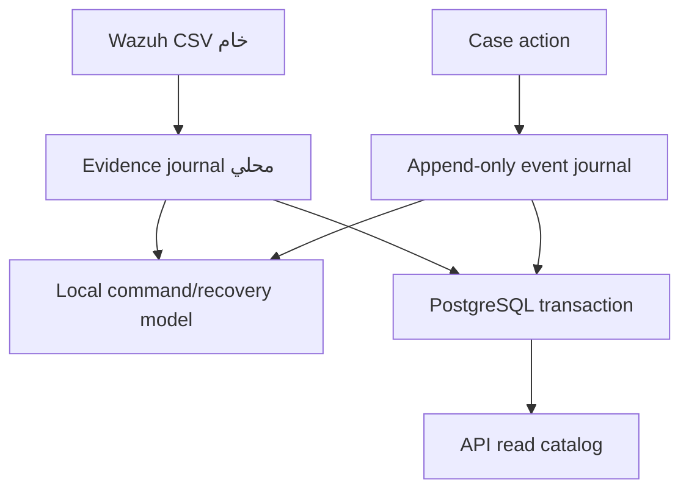

# PostgreSQL Runtime — Increments 6–12

## الهدف والحدود

Increment 6 يثبت PostgreSQL كمصدر قراءة API عند تفعيل Backend، مع بقاء Evidence
journal المحلي كـOutbox ومصدر إعادة إرسال. الكتابة متزامنة والقراءة تستخدم
`PostgresReadCatalog` للملخص والبحث وتفاصيل الحالات.

Migration V6 يضيف عقد V2، وهوية الأصل الثابتة وإصدار/معمارية الحزمة ودليل
`ACTIVE|RESOLVED`. أعمدة Observation تبقى immutable، بينما Exposure وCase إسقاطان
مشتقان من أحدث دليل صريح ولا يتغيران لمجرد غياب صف.



هذا يعني بوضوح:

- `source.csv` وملفات Case Events هي سجل إعادة الإرسال.
- الـAPI تقرأ من PostgreSQL عند تفعيل Backend، وإلا تستخدم الوضع المحلي.
- PostgreSQL تستقبل Canonical write projection متزامنة.
- هذا ليس HA ولاMulti-writer؛ مسار الكتابة ما زال serialized بقفل advisory.

## معاملة Import

عند تأكيد Import مع تفعيل PostgreSQL:

1. يبني Domain المحلي النتيجة بأسلوب copy-on-write.
2. يفتح الإسقاط اتصال JDBC ومعاملة `SERIALIZABLE`.
3. يأخذ `pg_advisory_xact_lock` واحداً لمسار الكتابة الكانوني.
4. ينشئ أويربط Tenant وSource Profile وImport Run.
5. يعيد تحليل الدليل الخام بالعقد نفسه ويرفض أي اختلاف في SHA-256 أوledger.
6. يطبّق المفاتيح الطبيعية و`ON CONFLICT`/select-update على الكيانات.
7. يربط Observation بالـImport ويحدّث Exposure وفق event time.
8. يعيد حساب Case severity من Exposures، لا من ترتيب الصفوف.
9. يكتب `domain_materialization` ويرفع `catalog_state.revision`.
10. يحدّث Import إلى `COMPLETED` ثم ينفذ Commit.
11. بعد نجاح PostgreSQL فقط يعتمد التطبيق Import محلياً كـ`COMPLETED`.

الـlock العام مقصود في هذه المرحلة ليمنع سباق upsert والحساب التجميعي. هو حد أداء
معلوم؛ لن يُستبدل بأقفال أدق قبل وجود benchmark حي يثبت الحاجة ويحافظ على النزاهة.

## إسقاط Workflow

يُكتب Case Event محلياً أولاً، ثم يُطبّق على الحالة المحلية، ثم تنفذ PostgreSQL
معاملة واحدة تقوم بـ:

- حل الحدث السابق حسب `tenant + case + idempotency_key`.
- قفل Case بواسطة `FOR UPDATE`.
- مطابقة `from_status` و`case_version`.
- إضافة `case_audit_event` بقيمة database sequence مستقلة و`source_sequence` محلية.
- تحديث Status وقرار الحالة و`workflow_version`.
- رفع catalog revision ثم Commit.

إذا انقطع الاتصال بعد حفظ الحدث محلياً، يبقى الملف Outbox قابلاً لإعادة الإرسال.
إعادة الطلب بالمفتاح والمحتوى نفسيهما لا تنشئ حدثاً ثانياً.

## النزاهة والهوية

V4 يضيف `public_id` من SHA-256 إلى Asset وComponent وCase وExposure وAudit Event
كي تبقى معرّفات API مطابقة للوضع المحلي. المعرفات الداخلية UUID حتمية للصفوف الجديدة،
مع بقاء المفاتيح الطبيعية وTenant-scoped foreign keys هي الضمان النهائي.

قيود `public_id` أضيفت `NOT VALID`: PostgreSQL تطبقها على الكتابات الجديدة، بينما
تسمح بفحص قاعدة قديمة قبل Validation شامل. View باسم
`rbvm.postgres_projection_reconciliation` يكشف Legacy rows الناقصة، Imports غير
المتصالحة، وفجوات Workflow.

## idempotency

| المستوى | مفتاح منع التكرار |
|---|---|
| Import projection | `tenant_id + import_id` في `domain_materialization` |
| ملف مصدر متكرر | `tenant + source_profile + file_sha256` |
| Observation | `tenant + source_profile + fingerprint` |
| Asset | `tenant + source_profile + normalized agent` |
| Component | `tenant + asset + normalized product` |
| Case | `tenant + source_profile + asset + vulnerability` |
| Exposure | `tenant + source_profile + asset + vulnerability + component` |
| Case action | `tenant + case + idempotency_key` و`case_version` |

## حالات الفشل

| نقطة الفشل | النتيجة | التعافي |
|---|---|---|
| قبل PostgreSQL Commit | Rollback كامل في PostgreSQL | إعادة Confirm من `source.csv` |
| بعد بناء Local وقبل Commit | Import يبقى `PREVIEW_READY` وHealth يصبح Degraded | إعادة Confirm؛ Domain replay وDB retry |
| بعد حفظ Case Event وقبل DB Commit | الحدث موجود محلياً والحالة DB لم تتغير | إعادة الطلب أوإعادة التشغيل |
| إعادة تشغيل بعد Import مكتمل | يعاد بناء Local ثم فحص `domain_materialization` | DB replay بلا إعادة كتابة |
| Migration checksum مختلف | Fail-fast قبل فتح HTTP | تحقيق سبب تغيير migration؛ لا تجاوز صامت |

لا تعرض API تغييرات النموذج المحلي قبل PostgreSQL Commit لأن قراءة API أصبحت من
PostgreSQL. يبقى النموذج المحلي مستخدماً للتحقق المسبق وإعادة بناء أوامر التعافي.

## migrations

`PostgresMigrator`:

- يتحقق أن المحرك PostgreSQL 14 أوأحدث.
- يأخذ Session advisory lock لمنع Migratorين متزامنين.
- يسجل version واسم الملف وSHA-256 في `rbvm.schema_migration`.
- يرفض تعديل migration مطبقة بدلاً من قبول drift.
- يطبق كل ملف داخل Transaction منفصلة.

المسار يستند إلى سلوك PostgreSQL الموثق للقيود المركبة والمعاملات والأقفال، وإلى
تحميل pgJDBC من الـclasspath عبر Java Service Provider:

- [pgJDBC: Initializing and connecting](https://jdbc.postgresql.org/documentation/use/)
- [PostgreSQL: transaction isolation](https://www.postgresql.org/docs/current/transaction-iso.html)
- [PostgreSQL: explicit and advisory locking](https://www.postgresql.org/docs/current/explicit-locking.html)
- [PostgreSQL: constraints](https://www.postgresql.org/docs/current/ddl-constraints.html)

## التشغيل

pgJDBC غير مضمّن في JAR التطبيق. يجب وضع Driver JAR موثوق على الـclasspath:

```bash
export RBVM_PROJECTION_BACKEND=POSTGRESQL
export RBVM_POSTGRES_DRIVER_JAR=/opt/jdbc/postgresql.jar
export RBVM_JDBC_URL='jdbc:postgresql://db.example/rbvm?sslmode=verify-full'
export RBVM_DB_USER=rbvm_app
export RBVM_DB_PASSWORD='from-a-secret-manager'
export RBVM_DB_MIGRATE=true
./scripts/check-postgres.sh
./scripts/run-server.sh
```

وثائق pgJDBC تذكر أن وجود Driver JAR على الـclasspath يكفي لتحميله، وأن
`sslmode=verify-full` يتحقق من الشهادة واسم المضيف. لا تطبع المنصة URL أوPassword في
Health أوlogs.

## بوابات PostgreSQL read backend

تحققت البوابات التالية على المحرك المحلي الحي بتاريخ 2026-08-14:

1. تطبيق V1–V5 وإثبات migration replay/checksum.
2. ملف 10,001 صف: تطابق كل العدادات مع Local baseline.
3. قطع الاتصال قبل Commit وإثبات عدم وجود Domain جزئي.
4. إعادة Import وCase Events وإثبات idempotency.
5. تحليل خطط استعلام Dashboard والبحث والفلاتر.
6. اختبار صلاحيات تمنع UPDATE/DELETE على Audit Event.
7. اختبار TLS ونسخ احتياطي واستعادة وقياس RPO/RTO.
8. نقل Reads إلى PostgreSQL وإثبات Health=`UP` و`catalogBackend=POSTGRESQL`.

النتائج والأرقام والأوامر موثقة في [`INCREMENT_6_VALIDATION.md`](INCREMENT_6_VALIDATION.md).
